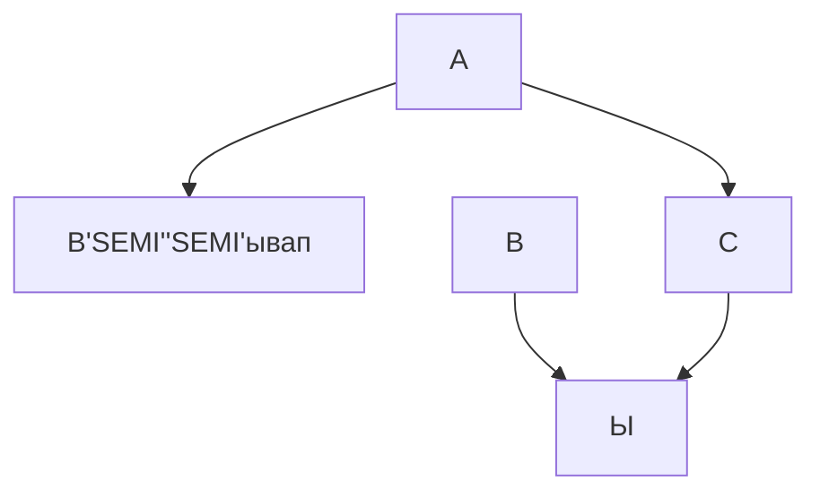

# OLTA-RU
Open Logical Tools Architecture  

В данный момент в этом разделе разрабатываются и строятся инструменты, приспособления и станки для изготовления печатных плат, запайки элементной базы, сборки и корпусирование электронных изделий.  

## Варианты и этапы создания печатных плат


```mermaid
graph TD;
    Раскройка текстолита-->Отдельными платами;
    Раскройка текстолита-->Кучей плат на одном листе;
    Отдельными платами-->С технологическими полями;
    Отдельными платами-->В чистовой размер;
    Кучей плат на одном листе-->С технологическими полями;
    Кучей плат на одном листе-->В чистовой размер;
```
