# OLTA-RU
Open Logical Tools Architecture  

В данный момент в этом разделе разрабатываются и строятся инструменты, приспособления и станки для изготовления печатных плат, запайки элементной базы, сборки и корпусирование электронных изделий.  

## Варианты и этапы создания печатных плат

```mermaid
graph TD;
classDef class1 fill:#544457, stroke:#000, stroke-width:4px
classDef class2 fill:#32465e, stroke:#000, stroke-width:4px
classDef class3 fill:#455744, stroke:#000, stroke-width:4px
classDef class4 fill:#5e4832, stroke:#000, stroke-width:4px
classDef class5 fill:#5e3332, stroke:#000, stroke-width:4px

   
    A([Обозначения])
    B([Отвергаю]):::class5
    C([Хотелось бы избежать.
      Мне не подходит.]):::class4
    D([Мой вариант]):::class3
    E([Более технологичный
      вариант, чем мой.  
      Возможно, к нему неплохо было бы
      стремиться в будущем.]):::class2
    F([Сверхтехнологичный для меня,
      даже не рассматриваю
      на обозримое будущее.]):::class1

    A-->B;
    A-->C;
    A-->D;
    A-->E;
    A-->F;

```

```mermaid
graph TD;
classDef class1 fill:#544457, stroke:#000, stroke-width:4px
classDef class2 fill:#32465e, stroke:#000, stroke-width:4px
classDef class3 fill:#455744, stroke:#000, stroke-width:4px
classDef class4 fill:#5e4832, stroke:#000, stroke-width:4px
classDef class5 fill:#5e3332, stroke:#000, stroke-width:4px

    Z([Виды плат])
    A([Односторонние]):::class3
    B([Двухсторонние]):::class2
    C([С меднением отвертий]):::class2
    D([Без меднения
      отверстий]):::class2
    
    Z-->A;
    Z-->B;

    B-->C;
    B-->D;
```

```mermaid
graph TD;
classDef class1 fill:#544457, stroke:#000, stroke-width:4px
classDef class2 fill:#32465e, stroke:#000, stroke-width:4px
classDef class3 fill:#455744, stroke:#000, stroke-width:4px
classDef class4 fill:#5e4832, stroke:#000, stroke-width:4px
classDef class5 fill:#5e3332, stroke:#000, stroke-width:4px

    Z([Исполнение медного слоя])
    A([Травление]):::class3
    B([Фрезерование]):::class2
    
    Z-->A;
    Z-->B;

```

```mermaid
graph TD;
classDef class1 fill:#544457, stroke:#000, stroke-width:4px
classDef class2 fill:#32465e, stroke:#000, stroke-width:4px
classDef class3 fill:#455744, stroke:#000, stroke-width:4px
classDef class4 fill:#5e4832, stroke:#000, stroke-width:4px
classDef class5 fill:#5e3332, stroke:#000, stroke-width:4px

    Z([Технология защиты меди от травления])
    A([ЛУТ]):::class5
    B([Фоторезист]):::class3
    C([Пленочный]):::class3
    D([Жидкий]):::class2

    Z-->A;
    Z-->B;

    B-->C;
    B-->D;
```

```mermaid
graph TD;
classDef class1 fill:#544457, stroke:#000, stroke-width:4px
classDef class2 fill:#32465e, stroke:#000, stroke-width:4px
classDef class3 fill:#455744, stroke:#000, stroke-width:4px
classDef class4 fill:#5e4832, stroke:#000, stroke-width:4px
classDef class5 fill:#5e3332, stroke:#000, stroke-width:4px

    Z([Масштаб])
    A([Отдельными платами]):::class3
    B([Кучей плат на одном листе]):::class2
    C([С технологическими полями]):::class4
    D([В чистовой размер]):::class3
    E([С первоначальным раскроем]):::class2
    F([Без первоначального раскроя]):::class2
    G([Раскройка текстолита]):::class3
    H([Раскройка текстолита]):::class2
    Z-->A;
    Z-->B;

    A-->C;
    A-->D;
    C-->G;
    D-->G;

    B-->E;
    B-->F;
    E-->H;
```

